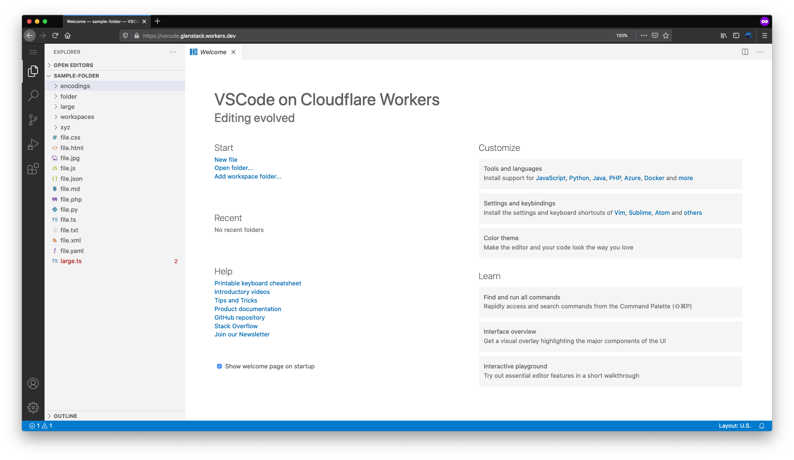

# VSCode Workers

A fork of [@Felx-B](https://github.com/Felx-B)'s excellent [build pipeline](https://github.com/Felx-B/vscode-web) for creating a web-ready compilation of [Visual Studio Code](https://github.com/microsoft/vscode), similar to the [Visual Studio Code for Web Playground](https://vscode-web-test-playground.azurewebsites.net/).

This version does a couple of minor manipulations to the compiled files, and deploys everything to [Cloudflare Workers](https://workers.cloudflare.com/).

## Getting Started

This project is deployed at [https://vscode.glenstack.workers.dev/](https://vscode.glenstack.workers.dev/). Although currently quite useless (the files are simply stored in memory), we have plans to create or adapt extensions to allow editing of [files on GitHub](https://github.com/glenstack/vscode-workers/issues/1) and/or of [local files using the new File System Access API](https://github.com/glenstack/vscode-workers/issues/2).

Any other suggestions are welcome.

## Building from source

To build from source, you need the same [prerequisites as VSCode](https://github.com/microsoft/vscode/wiki/How-to-Contribute#prerequisites).

1. `git clone git@github.com:glenstack/vscode-workers.git`

1. `cd vscode-workers`

1. `yarn`

1. `yarn build`

1. `yarn prepare-build`

1. `yarn demo`
